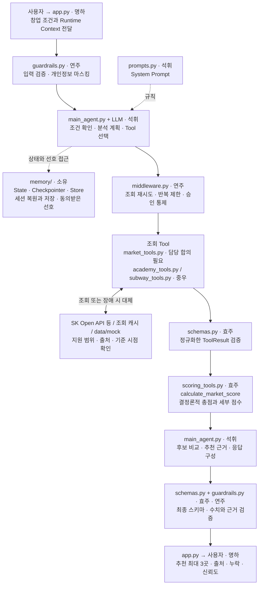
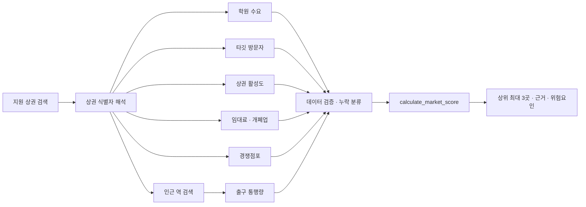

# StudySpot 전체 구조도

StudySpot은 서울의 API 지원 상권 중 사용자의 스터디카페 창업 조건에 맞는 후보를 비교하는 Agent다. 메인 Agent가 조건 확인과 Tool 선택을 맡고, 점수는 계산 Tool이 산출하며, Streamlit이 최대 3개 후보와 근거를 표시한다. 초기 분석 범위는 데이터 정합성이 확인된 5~10개 상권이다.

이 문서는 `8반_1조_설계서(초안).docx`의 1~3장과 사용자가 제시한 폴더 구조를 바탕으로 작성했다. **설계서 기준**은 원문에 명시된 요구사항, **연결 제안**은 모듈 통합을 위해 보완한 내용, **합의 필요**는 구현 전 팀이 결정할 내용이다. 작성 시점인 2026-09-10에 저장소에서 확인한 파일은 `README.md`와 `agent/prompts.py`이며, 아래 구조는 구현 목표다.

관련 문서: [동작 흐름과 분기](flow.md) · [연결 규격](interfaces.md)

## 1. 전체 구조



그림은 정상 분석의 큰 경로와 모듈 관계를 단순화했다. 점선은 규칙·상태 참조를 뜻한다. 실제로는 각 Tool 결과가 Agent로 돌아오고 Agent가 다음 조회나 계산 Tool을 선택하며, 그 반복은 [동작 흐름](flow.md)에서 설명한다. `main_agent.py`와 `app.py`의 입력·출력 역할을 그림에서 나누어 표시했으며 별도 인스턴스를 뜻하지 않는다.

조회 Tool은 외부 원문을 공통 식별자와 `ToolResult`로 변환하고, 계산 결과도 같은 공통 반환 형식을 따른다. Middleware의 재시도·대체 정책은 외부 조회에 적용하고, 계산과 저장에는 각각의 별도 정책을 적용한다. Memory의 Store 쓰기에는 명시적인 저장 요청이나 동의가 필요하다.

메인 Agent는 하나다. 학원·지하철·점수 모듈은 각각 호출 가능한 Tool이며 독립 Agent가 아니다. `prompts.py`는 행동 원칙을 제공하고, 재시도 횟수·입력 형식·승인 여부·점수 범위는 코드에서도 강제한다.

## 2. 폴더와 담당

아래 트리는 사용자가 제시한 목표 구조다. Python 패키지 초기화 파일명은 `__init__.py`로 표기한다. 트리의 파일이 모두 생성되었다는 의미는 아니다.

```text
spot-agent/
├── app.py                       # 명하: Streamlit 화면
├── agent/
│   ├── __init__.py
│   ├── main_agent.py            # 석휘: Agent 생성과 모듈 통합
│   └── prompts.py               # 석휘: System Prompt
├── tools/
│   ├── __init__.py
│   ├── market_tools.py          # 구현 담당 추가 합의
│   ├── academy_tools.py         # 중우: 학원 API
│   ├── subway_tools.py          # 중우: 지하철 API
│   └── scoring_tools.py         # 효주: 입지점수 계산
├── models/
│   ├── __init__.py
│   └── schemas.py               # 효주: ToolResult와 최종 응답 모델
├── memory/
│   ├── __init__.py
│   ├── state.py                 # 소유: Agent State
│   ├── checkpointer.py          # 소유: 단기 대화 상태 저장
│   └── store.py                 # 소유: 장기 Memory
├── middleware/
│   ├── __init__.py
│   ├── guardrails.py            # 연주: 입력과 출력 검증
│   └── middleware.py            # 연주: 재시도와 오류 처리
├── data/
│   └── mock/                   # 각 담당: 자기 모듈의 Mock 데이터
├── tests/
│   ├── test_agent.py            # 석휘: Agent 흐름
│   ├── test_api_tools.py        # 중우: API Tool
│   ├── test_memory.py           # 소유: State와 Store
│   ├── test_guardrails.py       # 연주: 검증과 오류 처리
│   ├── test_scoring.py          # 효주: 점수 계산
│   └── test_integration.py      # 명하: 전체 연결
├── docs/
│   ├── architecture.md
│   ├── flow.md
│   └── interfaces.md
├── .env.example
├── .gitignore
├── requirements.txt
└── README.md
```

| 모듈 | 책임 | 다른 모듈과의 경계 |
| --- | --- | --- |
| `app.py` | 입력 수집, 사용자·세션 식별자 전달, 추천 카드와 승인 화면 표시 | Tool을 직접 조합하거나 점수를 계산하지 않는다. |
| `agent/main_agent.py` | 모델·Tool·State·Middleware·출력 스키마 연결, 분석과 재분석 조정 | 외부 API 응답 파싱과 점수 공식을 Tool에 위임한다. |
| `agent/prompts.py` | 필수 조건, 조회 순서, 근거 사용, 저장·승인 원칙 | 실제 검증과 실행 제한은 Guardrail 및 Middleware가 담당한다. |
| `tools/*_tools.py` | 인자 검증, 원천 데이터 조회·정규화 또는 점수 계산 | 성공·실패 모두 공통 `ToolResult`를 반환한다. |
| `models/schemas.py` | 공통 모델, 타입, 값 범위와 상태별 제약 | UI·Agent·Tool이 같은 모델을 사용한다. |
| `memory/state.py` | 현재 조건, 후보, 조회 결과, 대화 이력 | 세션을 넘어 자동으로 선호를 영구 저장하지 않는다. |
| `memory/checkpointer.py` | 같은 대화의 State 복원·저장 | 조회 캐시와는 별개다. 사용자·세션 간 상태를 분리한다. |
| `memory/store.py` | 사용자별 선호·관심 상권 조회와 동의받은 저장 | `user_id`는 모델이 아니라 Runtime Context에서 받는다. |
| `middleware/guardrails.py` | 입력·출력·Tool 인자·근거·민감 행동 검증 | 차단 시 Tool 실행 전에 종료한다. |
| `middleware/middleware.py` | 조회 재시도·대체, 반복 제한, 요약, 승인 대기 | 변경된 조건이나 미승인 행동을 우회 실행하지 않는다. |

## 3. Tool 배치와 의존성

파일 배치는 사용자 트리와 설계서의 Tool 목록을 연결한 **제안**이다. 특히 `market_tools.py`의 구현 담당은 미정이다.

| 배치 위치 | Tool | 주요 데이터 또는 동작 |
| --- | --- | --- |
| `tools/market_tools.py` | `search_supported_districts` | 요청 지역에서 분석 가능한 후보 상권 |
| `tools/market_tools.py` | `resolve_area_entities` | 상권 ID, 행정코드, 좌표 변환 |
| `tools/market_tools.py` | `get_visitor_demographics` | 타깃 연령 방문자 특성 |
| `tools/market_tools.py` | `get_district_congestion` | 시간대별 혼잡도와 활성도 |
| `tools/market_tools.py` | `search_competitors` | 반경 내 경쟁 스터디카페 |
| `tools/market_tools.py` | `get_rent_and_closure_data` | 임대비용, 개·폐업, 안정성 참고 정보 |
| `tools/academy_tools.py` | `get_academy_demand` | 학원·교육 수요 |
| `tools/subway_tools.py` | `find_nearby_stations` | 좌표와 반경에 해당하는 지하철역 |
| `tools/subway_tools.py` | `get_station_exit_traffic` | 역별·요일별·시간대별 출구 통행량 |
| `tools/scoring_tools.py` | `calculate_market_score` | 후보별 총점, 세부 점수, 누락·신뢰도 |
| `memory/store.py`의 Tool 연결부 | `save_user_preferences` | 동의받은 사용자 선호 저장 |
| `memory/store.py`의 Tool 연결부 | `save_shortlist` | 명시적으로 선택한 관심 상권 저장 |
| 배치·담당 합의 필요 | `send_analysis_report` | 승인된 보고서 전송 |
| 배치·담당 합의 필요 | `create_site_visit_event` | 승인된 현장답사 일정 등록 |

외부 행동 두 개는 설계서에 존재하지만 사용자 트리에 실행 모듈이 없다. 승인 분기까지 설계하되 실제 전송·일정 등록이 구현되었다고 가정하지 않는다. 실행기를 연결하지 않은 경우 UI에서 기능 미지원 상태를 안내하며, 승인 후 성공한 것처럼 응답하지 않는다.

조회의 필수 의존성은 다음과 같다. 서로 독립적인 조회는 선행 식별자가 확보된 뒤 병렬 실행할 수 있으나, 초기 구현에서 순차 실행해도 된다.



조회 계획은 조건과 제공 범위에 따라 달라진다. 호출하지 않았거나 확보하지 못한 지표를 LLM이 채우지 않는다. 기본 6개 점수를 모두 제시하려면 각 지표의 데이터가 필요하며, 일부 지표가 없을 때의 계산 정책은 [연결 규격](interfaces.md)에 별도로 정리했다.

## 4. 상태와 저장 구조

| 구분 | 항목 | 수명과 갱신 기준 |
| --- | --- | --- |
| Runtime Context | `user_id`, `session_id`, `user_role` | 애플리케이션이 호출 시 제공한다. 해당 호출에서 변경하지 않는다. |
| State | `business_conditions`, `searched_areas`, `tool_results`, `current_candidates`, `conversation_history` | 대화 중 갱신한다. 같은 세션에서는 Checkpointer로 복원한다. |
| Store | `user_preferences`, `saved_shortlist` | 사용자 동의 또는 명시적 저장 요청에 따라 기록하고 새 세션에서도 읽는다. |
| 조회 캐시 | 상권·조회 인자별 원천 데이터 | 중복 API 호출 감소와 장애 시 대체에 사용한다. TTL과 저장 위치는 합의 필요다. |

조건을 합치는 우선순위는 **최신 명시적 입력 → 현재 세션 State → 저장된 선호**로 제안한다. 저장된 선호로 부족한 값을 보완하더라도 무엇을 적용했는지 화면에 보여준다. 대화 요약은 최신 구조화 조건을 덮어쓰지 않는다.

`session_id`와 Checkpointer의 `thread_id`를 같은 대화에 대응시키고, 사용자까지 포함해 충돌을 막는 매핑이 필요하다. 실제 인증 방식·DB·Checkpointer 구현은 설계서에서 정하지 않았다. 인메모리 Store만 사용할 경우 프로세스 재시작 후에도 유지되는 장기 저장이라고 설명해서는 안 된다.

## 5. 검증과 오류 처리 위치

| 위치 | 처리 |
| --- | --- |
| Agent 진입 전 | 프롬프트 탈취·비밀정보 공개 유도 차단, 개인정보 마스킹, 요청 범위 확인 |
| 매 모델 호출 전 | 반복 횟수 제한, 필요 시 대화 요약, 최신 조건 유지 |
| 조회 Tool 실행 전후 | 인자·식별자 검증, 일시적 실패 시 최초 호출 후 최대 2회 재시도, 캐시→Mock 순 대체 |
| 계산 Tool 호출 전 | 후보·단위·기준 시점 정합성 확인, 누락 구분, 현재 조건과 결과 연결 |
| 저장 Tool 실행 전 | 명시적 저장 요청 확인, 사용자 분리, 개인정보 마스킹 |
| 외부 행동 실행 전 | 실행 내용 제시, 승인·수정·거절 처리, 승인된 내용과 실제 인자 일치 확인 |
| 최종 응답 전 | `StudySpotResult` 검증, Tool 수치와 응답 대조, 출처·누락·Mock 표시 |

API 미지원 지역과 정상적인 빈 결과는 통신 장애가 아니다. 지원하지 않는 지역에 Mock 상권을 생성하지 않으며, 확인된 0건과 조회 실패도 구분한다. 상세 분기는 [동작 흐름](flow.md)을 따른다.

## 6. 설계서에서 보완하거나 결정할 사항

| 항목 | 문서 반영 또는 합의 필요 내용 |
| --- | --- |
| 원문 구조도와 기능 요구사항 불일치 | 원문 그림의 날씨·식사·좌석·이동수단 기능은 F-01~F-10 및 Tool 목록에 없어 이번 구조에서 제외했다. |
| 모델과 프레임워크 | 원문은 메인 모델 `gpt-4o-mini`, `temperature=0.1`, `timeout=30`, 요약 모델 `temperature=0.0`을 제시한다. 라이브러리 버전·Agent 생성 API·배포 방식은 미정이다. |
| 상권 데이터 연계 | 실제 API 엔드포인트, 지원 상권 목록, 코드 매핑, 반경, 공간 집계 방법, 데이터 단위를 확인해야 한다. API 제공 사실을 이 문서에서 검증한 것은 아니다. |
| 점수 공식 | 원문은 25·20·15·15·15·10의 배점만 제시한다. 정규화, 변경 가중치, 누락 처리, 신뢰도, 동점 규칙은 효주·석휘 합의가 필요하다. |
| 상권 안정성 | 평가영역에는 있으나 별도 점수 필드는 없다. 현재는 개·폐업 데이터를 위험요인과 근거로 연결하고, 일곱 번째 점수는 추가하지 않는다. |
| 응답 스키마 보완 | 추가 질문, 캐시 여부, 데이터 기준 시점, 승인 내용, 실행 결과를 구조적으로 담는 필드가 원문에 부족하다. [연결 제안](interfaces.md)을 검토한다. |
| 실행 한도 | 최대 반복 횟수, API별 타임아웃, 캐시 TTL, 요약 기준을 명시해야 한다. |
| 외부 행동 | 전송·일정 모듈의 담당, 제공 서비스, 승인 상태 저장·재개 방식, 중복 실행 방지를 결정해야 한다. |

위 미정 사항을 확정하기 전에도 각 담당자는 공통 `ToolResult` 형태의 Mock 결과로 Agent 흐름과 화면 연결을 준비할 수 있다. 다만 점수와 신뢰도 수치를 사용하는 시연에는 합의된 계산 정책이 먼저 필요하다.
