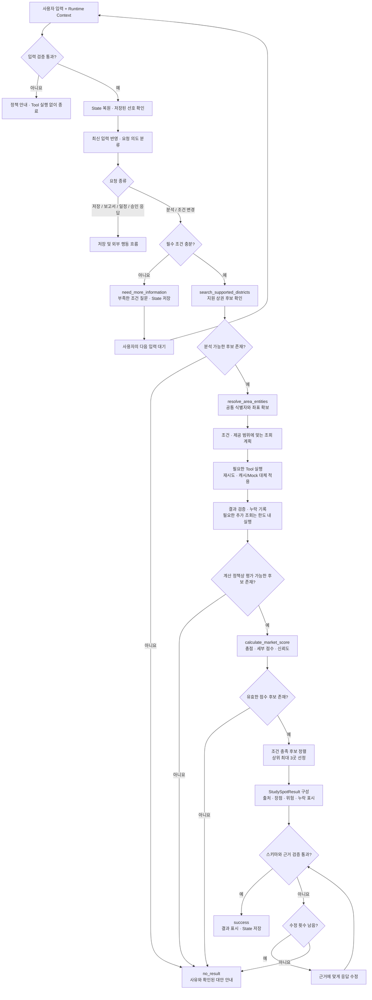
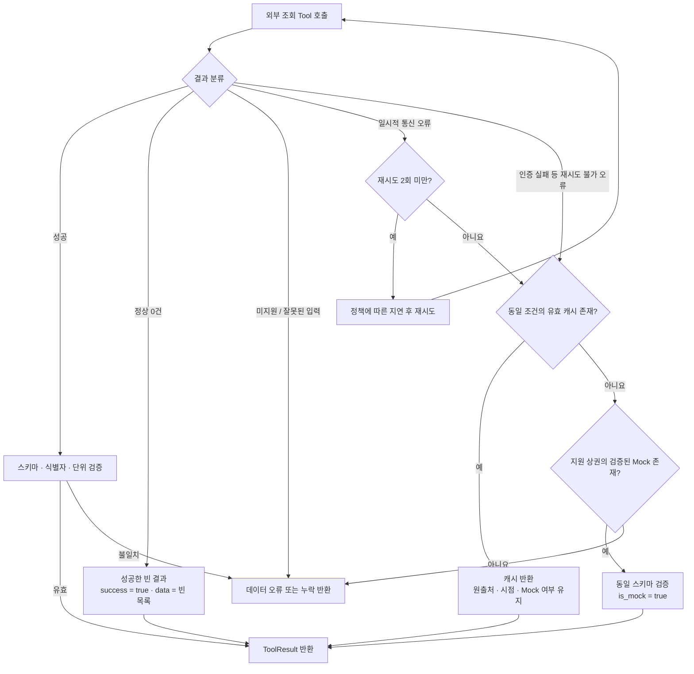
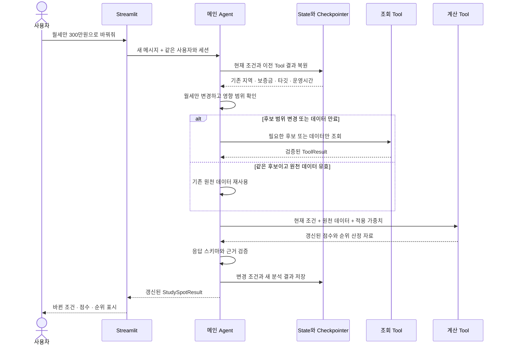
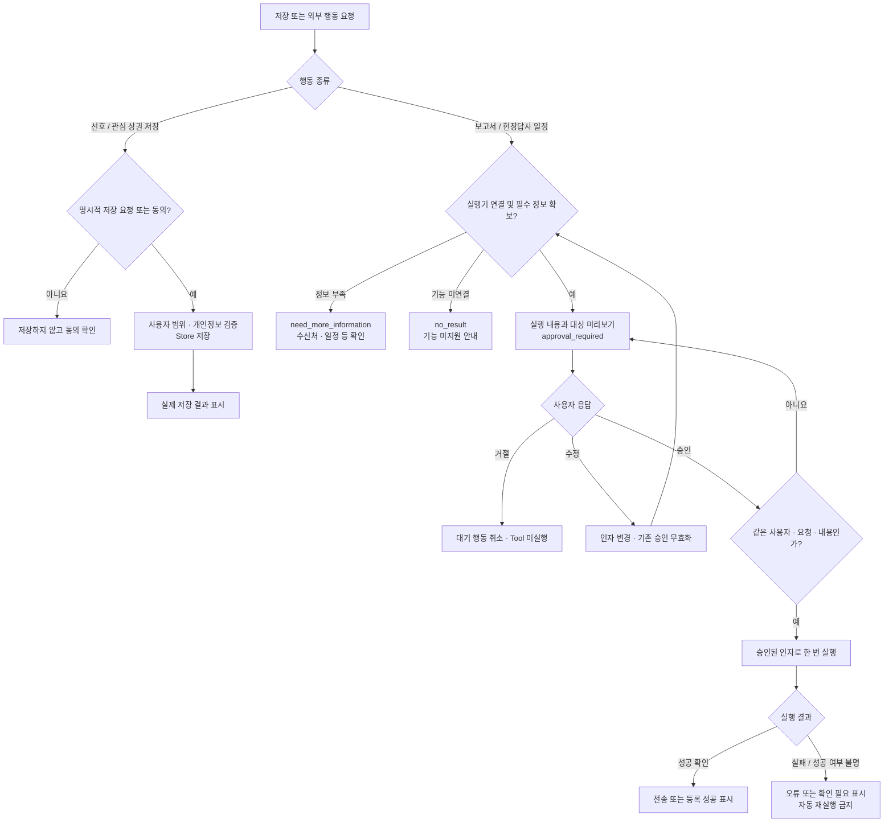

# StudySpot 동작 흐름과 분기

StudySpot은 필수 창업 조건을 확인한 뒤 지원 상권 검색, 식별자 변환, 필요한 데이터 조회, 결정론적 점수 계산, 근거 검증 순서로 실행한다. 사용자가 조건을 바꾸면 현재 State에 변경분을 반영해 재분석하며, 저장과 외부 행동은 요청·동의·승인 여부를 별도로 확인한다.

이 문서는 `8반_1조_설계서(초안).docx`의 2.2·2.5·3장 및 TS-01~TS-07을 구체화했다. **설계서 기준**과 **연결 제안**을 구분하며, 실제 런타임 구현이나 테스트 완료를 의미하지 않는다. [전체 구조](architecture.md) · [연결 규격](interfaces.md)

## 1. 분석 전체 흐름

`Block` 및 반복 한도 종료를 원문의 네 가지 `status`로 어떻게 표현할지는 원문에 명시되어 있지 않다. 연결안은 `no_result`와 사유 필드 조합이다. 상태 외에 사용자 안내·질문·승인 정보를 담는 필드는 [연결 규격 5절](interfaces.md#5-최종-응답)을 따른다.

## 2. 정상 분석 단계

| 순서 | 주체 | 처리와 다음 단계에 넘길 값 |
| --- | --- | --- |
| 1 | UI / 입력 Guardrail | 메시지와 Runtime Context를 전달하고 금지 요청·개인정보·입력 형식을 확인한다. |
| 2 | Agent / Memory | 같은 사용자의 세션 State를 복원한다. 저장된 선호가 있으면 현재 입력과 충돌하지 않는 값만 보완한다. |
| 3 | Agent | 희망 지역, 보증금, 월세, 타깃 연령, 주요 운영 시간을 확인한다. 부족하거나 모호하면 추가 질문 후 종료한다. |
| 4 | `search_supported_districts` | 희망 지역의 API 지원 후보를 확인한다. 예산은 임대 데이터가 확보된 이후 실제 비교·필터에 반영한다. |
| 5 | `resolve_area_entities` | 후보별 `commercial_area_id`, `administrative_code`, 위도·경도를 얻는다. 식별 실패 후보는 제외하고 사유를 남긴다. |
| 6 | Agent / 조회 Tool | 학원, 방문자, 활성도, 경쟁, 임대료 등 필요한 지표를 조회한다. 지하철 출구 통행량은 인근 역 식별 후 조회한다. |
| 7 | Middleware / Agent | 실패·빈 결과·누락·Mock·캐시·기준 시점을 구분한다. 충분한 데이터가 없으면 필요한 추가 조회만 제한된 횟수 내 실행한다. |
| 8 | 점수 Tool | 같은 조건·원천 데이터·가중치·계산 정책에 대해 같은 점수를 산출한다. LLM은 계산 결과를 변경하지 않는다. |
| 9 | Agent / 출력 Guardrail | 평가 가능한 후보를 최대 3개 선정하고 수치와 근거를 대조한다. 누락과 자료 품질을 설명한다. |
| 10 | UI / Checkpointer | 구조화된 결과를 표시하고 현재 조건·분석 결과를 세션에 저장한다. 장기 선호 저장은 별도 요청을 따른다. |

원문 예시인 “서울에서 보증금 5천만 원, 월세 200만 원 이내로 학생 수요가 많은 곳”에는 운영 시간과 구체적인 목표 연령이 없다. 이 입력은 바로 정상 분석으로 이어지지 않고 부족한 조건을 확인하는 분기로 간다.

### 데이터별 조회 조건

| 조회 | 선행 조건 | 조회 결과가 없을 때 |
| --- | --- | --- |
| 학원 수요 | 상권 ID, 행정코드, 타깃 연령 | 교육 수요 누락 표시 |
| 타깃 방문자 | 상권 ID, 타깃 연령 | 타깃 방문자 지표 누락 표시 |
| 활성도 | 상권 ID, 요일 유형, 운영 시간 | 해당 요일·시간대 지표 누락 표시 |
| 인근 지하철역 | 좌표, 조회 반경 | 실제 역 0개인지 조회 실패인지 구분 |
| 출구 통행량 | 확인된 역 ID, 요일 유형, 운영 시간 | 역을 임의 생성하지 않고 교통 지표 누락 또는 해당 없음 기록 |
| 경쟁점포 | 좌표, 조회 반경 | 정상 조회 0건과 조회 실패를 구분 |
| 임대료·개폐업 | 상권 ID, 행정코드 | 예산 충족 여부 미확인과 안정성 근거 부족을 표시 |

확인된 보증금·월세가 사용자의 상한을 넘으면 추천 대상에서 제외하는 방향을 제안한다. 면적·계약 조건·기준 단위가 달라 예산과 직접 비교할 수 없으면 충족 여부를 단정하지 않는다. 최종 필터 기준과 데이터가 없는 후보를 비교에 포함할지는 점수 담당과 합의해야 한다.

## 3. 오류와 데이터 대체

설계서의 “최대 2회 재시도”는 **최초 호출 1회 + 재시도 최대 2회 = 실제 API 호출 최대 3회**다. 재시도 주체를 Middleware로 통일하는 연결안을 사용하여 Tool 내부 재시도와 중첩되지 않게 한다.

오류 분류, 유효 캐시 판정, 지연 시간은 **연결 제안**이며 API별 정책을 확정해야 한다. 사용 가능한 대체 데이터는 동일 상권·인자·스키마에 맞아야 한다. 인증 실패와 같은 구성 오류는 재시도로 해결하려 하지 않고 담당자가 확인할 수 있도록 기록한다.

| 상황 | 처리 | 최종 응답에 반영할 내용 |
| --- | --- | --- |
| 필수 조건 부족 또는 모호함 | 분석 조회를 시작하지 않는다. | `need_more_information`, 부족한 조건과 질문 |
| 지원하지 않는 지역 | 해당 지역 조회·점수 계산을 중단한다. | `no_result`, 미지원 사유와 확인된 지원 지역 |
| 후보 하나의 식별 실패 | 해당 후보를 제외하고 나머지를 진행한다. | 제외 사유; 전부 실패하면 `no_result` |
| 정상 조회 0건 | 실제 관측값으로 취급하되 범위·조회 완전성을 확인한다. | “경쟁점포 0건” 등 근거가 있는 설명 |
| 일부 조회 실패 | 재시도와 대체 후에도 없으면 해당 지표를 누락 처리한다. | 세부 점수 `null`, `missing_data`, 계산 정책에 따른 낮은 `confidence` |
| 캐시 또는 Mock 사용 | 품질·출처를 유지하고 계산 가능 여부를 판단한다. | 캐시·Mock 여부, 기준 시점, 신뢰도 영향 |
| 계산 가능한 후보 1~2개 | 확보된 후보만 반환한다. | `success`, 1~2개 추천과 후보 부족 사유 |
| 유효 후보 0개 / 평가 불가 | 상권이나 점수를 만들어내지 않는다. | `no_result`, 조건 완화 또는 데이터 보완 안내 |
| 계산 실패 | 계산 Tool의 실패를 기록한다. LLM 계산으로 대체하지 않는다. | 실패한 후보 제외; 전부 실패하면 `no_result` |
| 최대 반복 횟수 도달 | 추가 모델·Tool 호출을 중단한다. | 이미 검증된 결과가 있으면 한계를 표시해 반환, 없으면 `no_result` |
| 출력 수치·스키마 오류 | 출처에 맞게 수정하고 제한 내 재검증한다. | 끝내 검증되지 않은 추천은 표시하지 않는다. |

부분 누락 데이터로 총점·신뢰도를 계산하는 공식은 설계서에 없다. 공식이 합의되지 않은 상태에서 임의로 0점을 채우거나 누락 항목의 가중치를 재분배하지 않는다. 평가 불가 후보 처리와 안내로 종료할 수 있어야 한다.

## 4. 조건 변경과 재분석

| 변경 조건 | 유지하는 것 | 다시 확인하는 것 |
| --- | --- | --- |
| 평가 우선순위만 변경 | 동일 후보의 유효한 원천 데이터 | 가중치 검증, 점수와 순위 재계산 |
| 보증금·월세 변경 | 지역·타깃·시간 및 조건과 무관한 유효 데이터 | 예산 필터, 이전에 예산으로 제외한 후보, 비용 적합성 |
| 타깃 연령 변경 | 지역·예산·운영 시간 | 타깃 방문자와 타깃에 의존하는 학원 데이터 |
| 운영 요일·시간 변경 | 지역·예산·타깃 | 출구 통행량, 활성도 등 시간에 의존하는 데이터 |
| 희망 지역 변경 | 사용자가 변경하지 않은 나머지 조건 | 지원 상권 검색, 식별자, 새 후보의 데이터 |

조건 변경 후에도 같은 캐시를 쓸 수 있는지는 원천 API의 조회 인자와 기준 시점으로 판단한다. 최종 추천 3개만 보관하면 예산 완화 시 탈락했던 후보를 복원할 수 없으므로, 전체 검색 후보와 제외 사유를 보관하거나 다시 검색해야 한다. 데이터 재사용을 하더라도 변경 전 총점을 그대로 반환하지 않는다.

새 세션에서는 같은 `user_id`의 Store 선호를 불러올 수 있지만, 이전 세션의 분석 State를 자동으로 현재 State처럼 사용하지 않는다. 저장된 선호에 필수 조건이 부족하면 다시 질문한다.

## 5. 저장과 외부 행동 승인

관심 상권·선호 저장은 **명시적인 저장 요청 또는 동의**가 실행 근거다. 보고서 전송·일정 등록은 별도로 실행 내용을 먼저 보여주고 **승인·수정·거절**을 받는다. 이 절은 StudySpot 제품의 요구사항이며, 이 문서를 작성하는 작업에서 실제 전송이나 일정 등록을 실행한다는 뜻이 아니다.

승인 전에 수신처·선택 상권·보고서 내용 또는 방문 일시를 확정한다. 승인은 대기 중인 특정 행동과 그 인자에만 유효하며, 분석 내용·대상·일시가 바뀌면 다시 미리보기를 제시한다. 단순히 모델이 `requires_approval=false`를 출력했다고 실행 권한이 생기지 않는다.

연결 제안은 승인 상태를 Checkpointer에 복원 가능한 형태로 유지하고, 실행 식별자로 중복 클릭·화면 재실행을 막는 것이다. 전송·일정 실행에는 조회용 “최대 2회 재시도”를 적용하지 않는다. 타임아웃으로 성공 여부가 불명확하면 먼저 제공 서비스의 실행 결과를 확인해야 한다. Store 저장 실패 역시 원문대로 임의 재시도하지 않는다.

## 6. UI에서 처리할 응답 상태

| `status` | 화면 동작 | 추천 목록 | 다음 입력 |
| --- | --- | --- | --- |
| `success` | 검증된 분석 결과 또는 확인된 행동 결과 표시 | 분석 성공이면 1~3개; 저장·행동 성공은 별도 실행 결과로 표시하는 연결안 | 조건 변경, 관심 상권 선택, 후속 행동 |
| `need_more_information` | 부족한 조건이나 행동 정보를 질문 | 새 추천은 생성하지 않음 | 부족한 값 입력 |
| `no_result` | 미지원·후보 없음·평가 불가·실패 사유 안내 | 새 추천은 생성하지 않음 | 조건 변경 또는 재시도 요청 |
| `approval_required` | 확정된 실행 내용과 승인·수정·거절 UI 표시 | 필요한 경우 기존 검증 결과 참조 | 승인·수정·거절 |

조건 변경 직후의 실패·추가 질문 응답에서 이전 분석을 보여주더라도 “이전 조건의 결과”로 구분한다. `requires_approval`은 `approval_required`일 때만 `true`로 맞추는 연결안을 사용한다. 거절과 실행 실패의 세부 상태는 최상위 상태를 늘리기보다 별도 행동 결과 필드로 표현하는 안을 [연결 규격](interfaces.md)에 제시했다.

## 7. 검증 시나리오와 담당 연결

아래는 구현 후 수행할 테스트 설계다. 현재 테스트를 통과했다는 뜻이 아니다.

| 근거 | 검증할 동작 | 테스트 위치와 담당 |
| --- | --- | --- |
| TS-01 | 조건이 충분하면 지원 상권→식별자→필요한 조회→계산 순서 준수, 최대 3개 반환 | `test_agent.py` 석휘, `test_integration.py` 명하 |
| TS-02 | 최초 포함 최대 3회 API 호출, 캐시·Mock·누락 구분 | `test_api_tools.py` 중우, `test_guardrails.py` 연주 |
| TS-03 | 프롬프트·API Key 공개 유도 시 Tool 미실행 | `test_guardrails.py` 연주 |
| TS-04 | 같은 세션에서 변경된 조건만 반영하고 점수 재계산 | `test_memory.py` 소유, `test_agent.py` 석휘 |
| TS-05 | 미지원 지역은 Mock으로 꾸미지 않고 `no_result` | `test_agent.py` 석휘, `test_api_tools.py` 중우 |
| TS-06 | 같은 사용자 새 세션에서 동의받은 선호 복원, 사용자 간 격리 | `test_memory.py` 소유 |
| TS-07 | 승인 전 전송 0회, 승인 후 정확한 인자로 1회 | `test_guardrails.py` 연주, `test_integration.py` 명하 |
| F-01 보완 | 필수 조건 누락 시 분석 Tool 호출 0회 | `test_agent.py` 석휘 |
| F-04 보완 | 같은 입력·정책의 점수 반복 일치, 누락·가중치·동점 처리 | `test_scoring.py` 효주 |
| F-05·F-08 보완 | 후보 0·1·2·3개, 일부 데이터 누락, 출력 스키마 및 근거 일치 | `test_scoring.py` 효주, `test_integration.py` 명하 |
| F-09 보완 | 승인 후 내용 수정 시 재승인, 거절 시 미실행, 중복 실행 방지 | `test_guardrails.py` 연주, `test_integration.py` 명하 |

상권 Tool 구현 담당이 정해지면 `test_api_tools.py`의 상권 조회 테스트 소유권도 함께 정한다.
